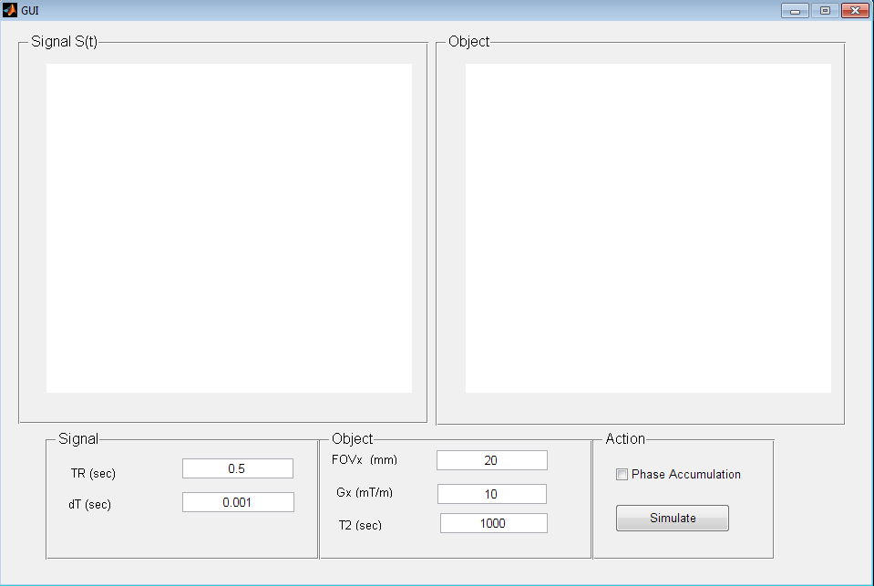
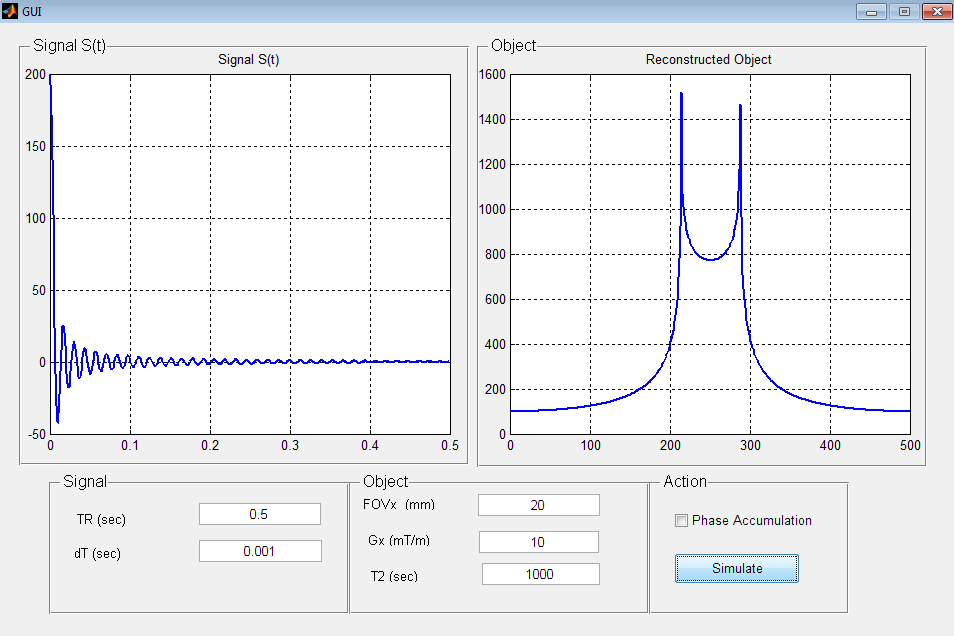
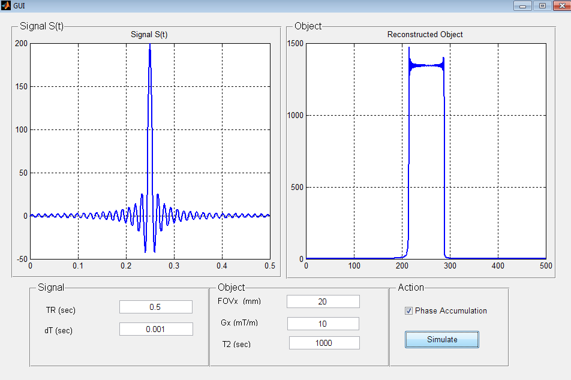
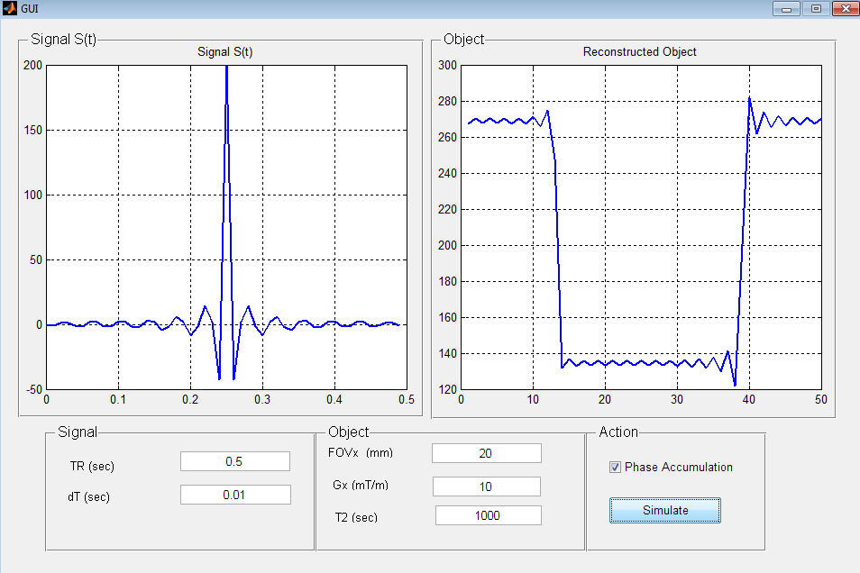
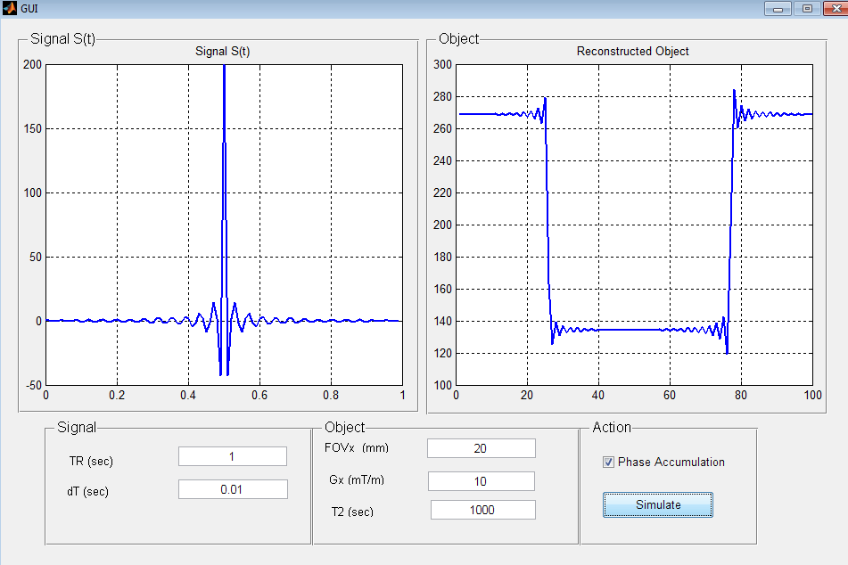
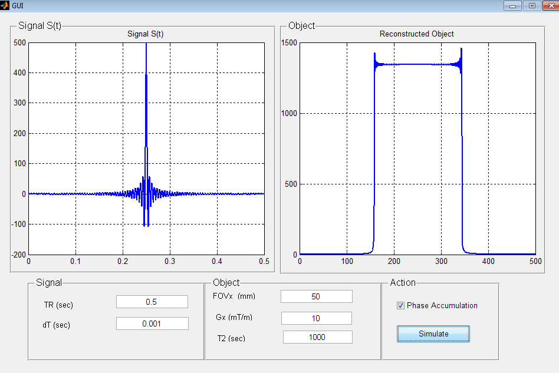
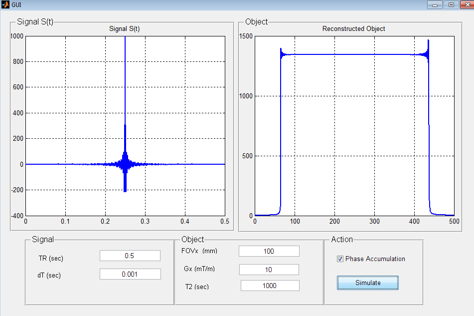
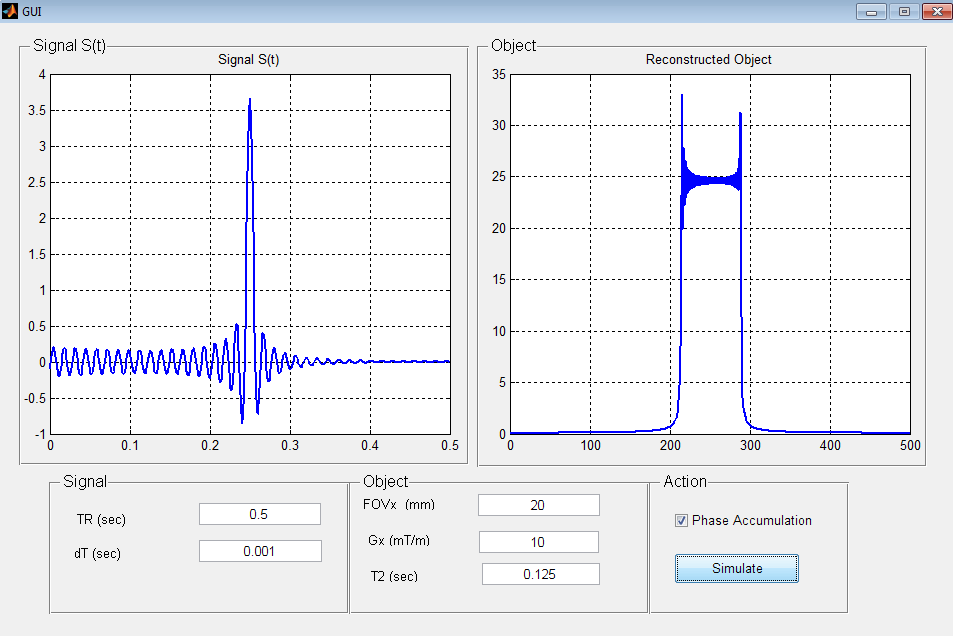

# MRI Signal Acquisition 
A simulation of MRI signal acquisition from 1D rod object. Investigation of effect of different parameters.

and 

$$ 
k_x(t) = \frac{\gamma}{2\pi} \int_{0}^{t} G_x(\tau) d\tau
$$

Where 
$$G_x(\tau)$$
is the gradient of in x direction.

## UI Simulation tool

## Imaging Sequence

* Without Phase Accumulation

* With Phase Accumulation

## Sampling time 

* Aliasing due to down sampling

* Still aliasing exists while increasing recording time.

## Field Of View (FOV)

Changing FOV will affect the spatial resolution

## T2 Effect

T2 represents an exponential decay weighting of the signal. 

